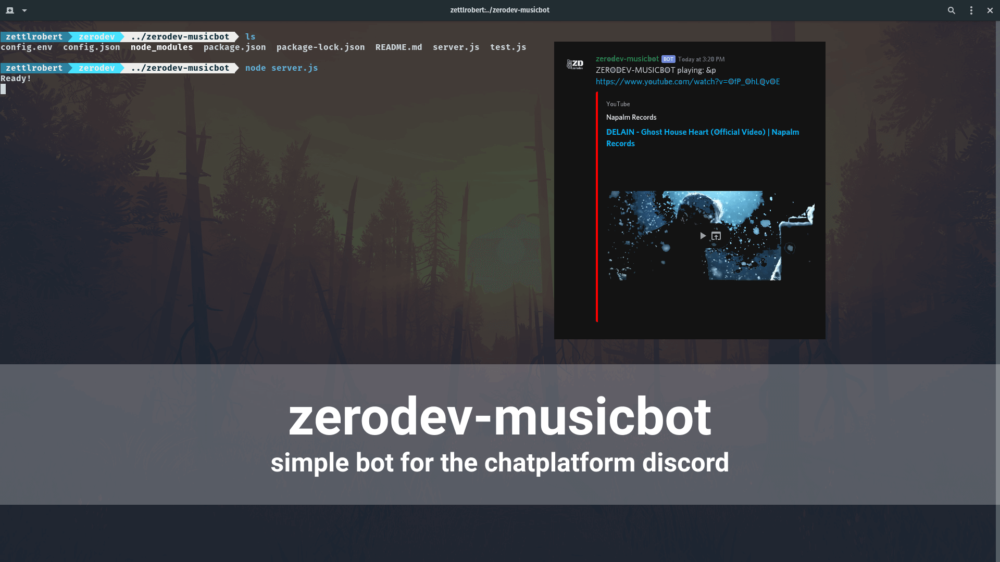

# zerodev-musicbot

simple bot for the chat application discord, it will play music from a passed link in the voice channel the user is currently using.

## Dependencies

- discord.js
- ffmpeg
- opusscript
- ytdl-core

## Dev Dependencies
- nodemon